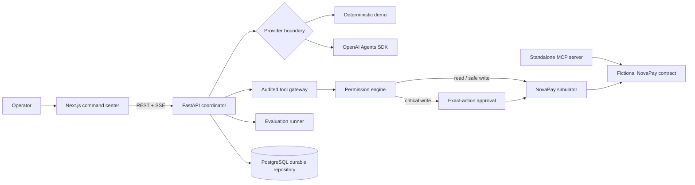

# ResolveAI

**Auditable incident intelligence that reasons with evidence and keeps humans in control.**

ResolveAI is a production-shaped engineering case study for bounded agentic incident response. It investigates a fictional NovaPay outage, collects typed evidence, maintains competing hypotheses, proposes a remediation, pauses at a policy boundary, and validates recovery after an operator approves the exact action.

The application is intentionally honest about execution: the public experience uses deterministic simulated systems, while the same typed provider boundary can call the OpenAI Agents SDK when configured.

> NovaPay, its transactions, logs, deployments, customers, and incidents are entirely fictional. No real payment system is connected.

## What you can verify

- A full incident state machine from `NEW` to `RESOLVED`, including rejection and failure branches.
- Every supported diagnosis cites evidence IDs owned by the incident.
- Read tools can run automatically; critical writes fail closed and require an expiring approval.
- Approvals are bound to incident, requested action, tool, tool call, expiry, reviewer, and a canonical hash of the exact arguments. Consumption is atomic in PostgreSQL.
- A standalone typed MCP server exposes 14 bounded NovaPay operations.
- Forty deterministic evaluation cases cover scenario contracts; approval and injection cases actively probe the production tool gateway.
- UI results distinguish `SIMULATED`, `EXECUTED`, and `NOT_EXECUTED` behavior.

## Architecture



The model may propose an action; only application policy can authorize it. The local coordinator uses the gateway/simulator directly; the standalone MCP server is an inspectable protocol surface, not an alternate authorization path. See [the architecture notes](docs/architecture.md), [security model](docs/security.md), and [security invariants](docs/security-invariants.md).

## Quick start

Prerequisites: Node.js 20.9+, Python 3.11+, and npm.

```powershell
git clone <your-fork-or-repository-url>
cd resolve-ai
python -m venv .venv
.\.venv\Scripts\python.exe -m pip install -e "services/api[dev]" -e packages/novapay-mcp
npm install
Copy-Item .env.example .env.local
```

Start the API and web app in separate terminals:

```powershell
.\.venv\Scripts\python.exe -m uvicorn app.main:app --app-dir services/api --reload --port 8000
npm run dev
```

Open [http://localhost:3000](http://localhost:3000), launch the flagship incident, and approve or reject the proposed rollback. Demo mode needs no API key.

### Docker Compose

```bash
docker compose up --build
```

The web app is available on port 3000 and the API/OpenAPI UI on ports 8000 and 8000/docs. Compose applies the Alembic migrations and starts the API with the PostgreSQL repository. The non-Docker quick start keeps `PERSISTENCE_BACKEND=memory` for a resettable, no-dependency demo.

To run the API against an existing PostgreSQL instance without Compose, set `PERSISTENCE_BACKEND=postgres` and `DATABASE_URL`, apply `alembic upgrade head` from `services/api`, and then start the API. Do not use the placeholder Compose password outside local development.

## Optional OpenAI provider

Keep secrets in `.env.local` (ignored by Git), then set:

```dotenv
AI_PROVIDER=openai
ENABLE_REAL_AI=true
OPENAI_API_KEY=your_key
OPENAI_MODEL=gpt-6-luna
```

The provider returns the same Pydantic `Diagnosis` contract as demo mode. Tool authorization, evidence ownership, timeouts, and approval enforcement remain server-side. See [agent behavior](docs/agents.md).

An explicitly authorized live smoke test is available and is never part of baseline CI:

```powershell
$env:RUN_OPENAI_LIVE_SMOKE="1"
$env:AI_PROVIDER="openai"
$env:ENABLE_REAL_AI="true"
.\.venv\Scripts\python.exe -m pytest services/api/tests/test_openai_live.py -m live
```

## Verification

```powershell
# Python
.\.venv\Scripts\python.exe -m pytest services/api/tests packages/novapay-mcp/tests
.\.venv\Scripts\python.exe -m ruff check services/api packages/novapay-mcp evals
.\.venv\Scripts\python.exe -m mypy services/api/app packages/novapay-mcp/src

# Web
npm run lint
npm run typecheck
npm test
npm run build

# With both local servers running
npm run test:e2e
```

Run the benchmark directly with `.\.venv\Scripts\python.exe evals/run_local.py`, or execute it from the Evaluation Center. Set `$env:RESOLVEAI_CODE_REVISION=(git describe --always --dirty)` before starting the API or runner to bind new results to the checked-out revision and disclose local changes; CI injects the full GitHub commit SHA automatically. If no revision is supplied, the UI says `Not configured` rather than implying reproducibility. The historical 97.5% is a deterministic scenario-contract result (39/40), not OpenAI model accuracy. Security cases actively attempt an unapproved registered critical action against `ToolGateway`; they do not represent a red-team assessment of an OpenAI model. The deliberately retained `eval_false_correlation_020` failure remains visible.

## Repository map

```text
apps/web/                 Next.js command center and Playwright tests
services/api/             FastAPI workflow, domain policy, providers, migrations
packages/novapay-mcp/     Standalone MCP v2 operations server
evals/                    40-case deterministic benchmark
fixtures/                 Controlled fictional service fixture
docs/                     Architecture, security, demo, ADRs, and launch notes
```

## Project posture

This repository demonstrates secure orchestration patterns; it is not a claim that an autonomous system should receive unrestricted production access. The default no-dependency store is intentionally ephemeral, PostgreSQL is opt-in (and used by Compose), and live GitHub writes are disabled. Authentication is not implemented for the local portfolio demo, so approval actors are self-asserted demo identities rather than authenticated enterprise principals. Read [project status](PROJECT_STATUS.md) before adapting it for a hosted or multi-user environment.

## Contributing and security

Contributions are welcome through the process in [CONTRIBUTING.md](CONTRIBUTING.md). Report vulnerabilities according to [SECURITY.md](SECURITY.md). Released under the [MIT License](LICENSE).
