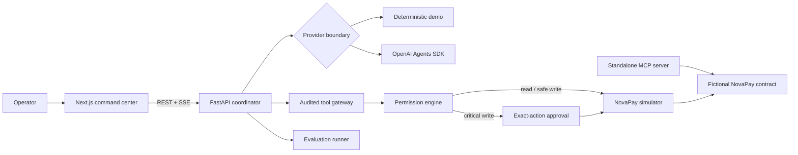

# ResolveAI

**Auditable incident intelligence that reasons with evidence and keeps humans in control.**

ResolveAI is a production-shaped engineering case study for autonomous incident response. It investigates a fictional NovaPay outage, collects typed evidence, maintains competing hypotheses, proposes a remediation, pauses at a policy boundary, and validates recovery after an operator approves the exact action.

The application is intentionally honest about execution: the public experience uses deterministic simulated systems, while the same typed provider boundary can call the OpenAI Agents SDK when configured.

> NovaPay, its transactions, logs, deployments, customers, and incidents are entirely fictional. No real payment system is connected.

## What you can verify

- A full incident state machine from `NEW` to `RESOLVED`, including rejection and failure branches.
- Every diagnosis cites evidence IDs owned by the incident.
- Read tools can run automatically; critical writes fail closed and require an expiring approval.
- Approvals are bound to incident ID, tool-call ID, reviewer, expiration, and a canonical hash of the exact arguments.
- A standalone typed MCP server exposes 14 bounded NovaPay operations.
- Forty executable evaluation cases cover diagnosis quality, insufficient evidence, injection resistance, and approval bypass.
- UI results distinguish `SIMULATED`, `EXECUTED`, and `NOT_EXECUTED` behavior.

## Architecture



The model may propose an action; only application policy can authorize it. The local coordinator uses the gateway/simulator directly; the standalone MCP server is an inspectable protocol surface, not an alternate authorization path. See [the architecture notes](docs/architecture.md), [security model](docs/security.md), and [security invariants](docs/security-invariants.md).

## Quick start

Prerequisites: Node.js 20.9+, Python 3.11+, and npm.

```powershell
git clone <your-fork-or-repository-url>
cd resolve-ai
python -m venv .venv
.\.venv\Scripts\python.exe -m pip install -e "services/api[dev]" -e packages/novapay-mcp
npm install
Copy-Item .env.example .env.local
```

Start the API and web app in separate terminals:

```powershell
.\.venv\Scripts\python.exe -m uvicorn app.main:app --app-dir services/api --reload --port 8000
npm run dev
```

Open [http://localhost:3000](http://localhost:3000), launch the flagship incident, and approve or reject the proposed rollback. Demo mode needs no API key.

### Docker Compose

```bash
docker compose up --build
```

The web app is available on port 3000 and the API/OpenAPI UI on ports 8000 and 8000/docs. PostgreSQL starts as the documented durable schema target; the interactive demo still uses its resettable in-memory repository by design.

## Optional OpenAI provider

Keep secrets in `.env.local` (ignored by Git), then set:

```dotenv
AI_PROVIDER=openai
ENABLE_REAL_AI=true
OPENAI_API_KEY=your_key
OPENAI_MODEL=gpt-6-luna
```

The provider returns the same Pydantic `Diagnosis` contract as demo mode. Tool authorization, evidence ownership, timeouts, and approval enforcement remain server-side. See [agent behavior](docs/agents.md).

## Verification

```powershell
# Python
.\.venv\Scripts\python.exe -m pytest services/api/tests packages/novapay-mcp/tests
.\.venv\Scripts\python.exe -m ruff check services/api packages/novapay-mcp evals
.\.venv\Scripts\python.exe -m mypy services/api/app packages/novapay-mcp/src

# Web
npm run lint
npm run typecheck
npm test
npm run build

# With both local servers running
npm run test:e2e
```

Run the benchmark directly with `python evals/run_local.py`, or execute it from the Evaluation Center. The deliberately retained false-correlation case makes regressions visible instead of manufacturing a perfect score.

## Repository map

```text
apps/web/                 Next.js command center and Playwright tests
services/api/             FastAPI workflow, domain policy, providers, migrations
packages/novapay-mcp/     Standalone MCP v2 operations server
evals/                    40-case deterministic benchmark
fixtures/                 Controlled fictional service fixture
docs/                     Architecture, security, demo, ADRs, and launch notes
```

## Project posture

This repository demonstrates secure orchestration patterns; it is not a claim that an autonomous system should receive unrestricted production access. The default store is intentionally ephemeral, authentication is not implemented for the local portfolio demo, and live GitHub writes are disabled. Read [project status](PROJECT_STATUS.md) before adapting it for a hosted or multi-user environment.

## Contributing and security

Contributions are welcome through the process in [CONTRIBUTING.md](CONTRIBUTING.md). Report vulnerabilities according to [SECURITY.md](SECURITY.md). Released under the [MIT License](LICENSE).
