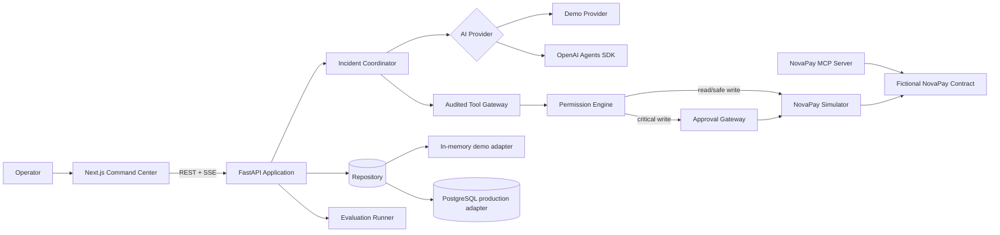
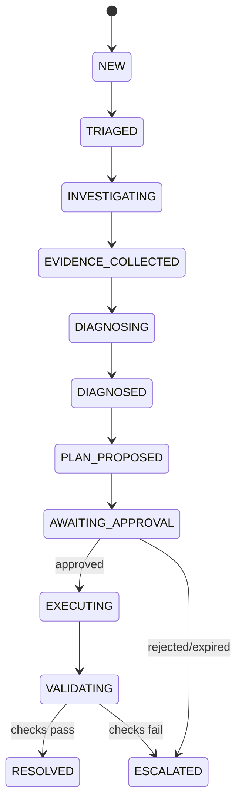

# Architecture

ResolveAI is a modular monorepo with a Next.js command center, a FastAPI application service, a standalone NovaPay MCP server, deterministic evaluation assets, and controlled fixture code.

## Workflow

## Trust boundaries

The model proposes; the application authorizes. Tool arguments are validated before policy evaluation. An approval binds the requested action, tool, tool call, incident, and canonical argument hash and cannot authorize an expired request or replay. PostgreSQL consumes the approval with one conditional update before the side effect. Evidence IDs in model output are checked against incident-owned evidence. Retrieved text is delimited and treated as untrusted.

## Data strategy

`InMemoryRepository` remains the explicit no-dependency demo/test adapter. `PostgresRepository` is the production persistence implementation and writes incidents, events, evidence, hypotheses, diagnoses, plans, tool calls, approvals, agent runs, audit history, validation, reports, and evaluation runs. It rehydrates state on startup. Compose selects it with `PERSISTENCE_BACKEND=postgres`; the default local configuration remains `memory`.

The coordinator keeps an in-process subscriber cache for SSE. PostgreSQL is the system of record, but horizontal event fan-out is not implemented; a hosted multi-worker deployment must add durable event delivery before scaling the realtime path.

## Traceability

The HTTP middleware accepts a valid caller correlation ID or creates one server-side. The incident carries it through events, runs, tool calls, approvals, audit records, validation, and the final report. MCP responses create their own server-side correlation ID and include it in their audit envelope. Structured logs record identifiers and safe metadata, never raw prompts, keys, or unrestricted payloads.

## MCP relationship

The current coordinator calls `ToolGateway` and `NovaPaySimulator` directly. The standalone MCP server models the same fictional operations for protocol inspection and external client experiments; it is not invoked by the local coordinator and does not bypass application policy. Its critical functions return approval proposals without executing them.

## Realtime choice

Server-Sent Events fit the one-way event stream from workflow to browser. Commands such as approve/reject remain ordinary authenticated REST requests. Events are emitted by actual workflow steps; optional deterministic delay is labeled simulated and exists only for demo legibility.
