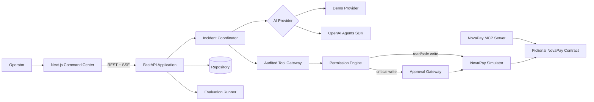
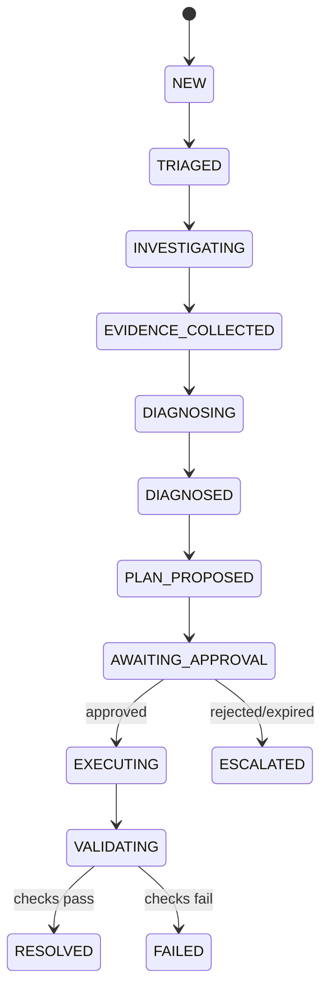

# Architecture

ResolveAI is a modular monorepo with a Next.js command center, a FastAPI application service, a standalone NovaPay MCP server, deterministic evaluation assets, and controlled fixture code.

## Workflow

## Trust boundaries

The model proposes; the application authorizes. Tool arguments are validated before policy evaluation. An approval stores a hash of canonical arguments and cannot authorize a changed tool call, another incident, an expired request, or a replay. Evidence IDs in model output are checked against incident-owned evidence. Retrieved text is delimited and treated as untrusted.

## Data strategy

The interactive local demo intentionally uses an isolated `InMemoryRepository` so reset is immediate and repeatable. A PostgreSQL schema and migration document the intended production persistence contract, but a PostgreSQL repository adapter does not yet exist. This is an explicit demo/runtime distinction, not a claim of production durability.

## MCP relationship

The current coordinator calls `ToolGateway` and `NovaPaySimulator` directly. The standalone MCP server models the same fictional operations for protocol inspection and external client experiments; it is not invoked by the local coordinator and does not bypass application policy. Its critical functions return approval proposals without executing them.

## Realtime choice

Server-Sent Events fit the one-way event stream from workflow to browser. Commands such as approve/reject remain ordinary authenticated REST requests. Events are emitted by actual workflow steps; optional deterministic delay is labeled simulated and exists only for demo legibility.
